# The Trust Boundary

The [proof map](proof-map.md) traces the soundness argument *above* the verifier model; this
page is the trust document for what sits *below* it: the boundary between the deployed Rust
verifier and the Lean development, what crosses that boundary, and exactly what a reader must
trust rather than check. It is the content companion to the
[trust discipline](../formal-verification.md#trust-discipline) section — that section explains
*how* claims are censused at build time (the *checked trust boundary* mechanism of the
[glossary](glossary.md)); this page explains *what* the fixture captures check. Directory-level
orientation is in the [source map](source-map.md).

## The invariant

> The deployed Rust verifier is executed on a proof string and returns the multi-scalar
> multiplication (MSM) it would have evaluated — the URS coefficient block plus the
> (coefficient, commitment) term list. Captured MSMs, together with the captured challenge
> schedule that produced them, are the **entire checkable trust boundary**.
>
> Everything else transcribed from halo2/orchard — the `configure` port, keygen, query
> layouts, the Fiat–Shamir schedule model, the URS and VK dumps — exists only to make the
> Lean development writable. None of it is *trusted*: if any such transcription is incorrect
> in a soundness-relevant way — i.e. it admits a proof the deployed verifier accepts but the
> Lean model does not — then some fingerprint-match theorem must fail, **except with
> probability ≤ ε over the randomness of the captured inputs, conditional on the enumerated
> premises below**. Both ε and the premises are themselves enumerated, never implicit.

Three scoping rules give the invariant its precise shape:

- **One-way correctness.** Only *deployed-accepts ⊆ model-accepts* is soundness-relevant. The
  model's accept set is `assemble? = some m ∧ m.eval urs = 0` — rejection is `none`, never a
  zero MSM. A transcription error that makes the deployed verifier reject proofs the model
  accepts is out of scope; completeness is not a goal.
- **The verifying key is inside the boundary.** Lean *reconstructs* the VK from the ported
  `configure`/keygen, and the match compares the reconstruction against captured data. A
  soundness-relevant port error moves an MSM base point or coefficient and the match fails.
- **The model's own rejections stay inside deployed rejections.** `assemble?` rejects on
  read-schedule shape, `xⁿ = 1`, the multiopen point `x₃` colliding with an opened point, and
  a duplicated (commitment-slot, opening-point) query — all challenge/VK-dependent, never
  proof-value-dependent, each mirroring a deployed non-accepting path (two
  `.invert().unwrap()` panics and an `OpeningError` in halo2). Each capture witnesses this
  containment empirically with a `valid_capture_assembles` theorem.

## The boundary artifact

The statement of record is per-family and per-proof: the
`nonInteractiveFingerprint_matches_derived` theorems, one in each family's
`Zcash/Snark/Fixtures/*/Boundary.lean`.

| Family | Actions | Seed | Accepting run? | Statement of record (namespace) |
|---|---|---|---|---|
| `SingleAction` | 1 | `0x53` (`S`) | yes | `Fixture` (plus the `…_derived_inputs` form) |
| `MultiAction` | 2 | `0x4d` (`M`) | yes | `Fixture2` |
| `SingleActionRandom` | 1 | `0x52` (`R`) | no — match-only | `FixtureRandom` |
| `MultiActionRandom` | 2 | `0x72` (`r`) | no — match-only | `FixtureRandom2` |
| `TripleActionRandom` | 3 | `0x33` (`3`) | no — match-only | `FixtureRandom3` |

Each theorem states: Lean's `assemble`, run at challenges derived by Lean's own Fiat–Shamir
schedule model (`deriveChallenges`) and at the verifying key spelled as its end-to-end
derivation from the ported `configure`/keygen at the captured URS (`derivedActionVk`), produces
an MSM equal coefficient-for-coefficient to the one the deployed verifier evaluated. The
derived form is what makes the transcriptions checkable rather than trusted:

- **Challenges are not taken as given.** A wrong schedule model either queries the captured
  oracle at an unrecorded key (receiving a sentinel value proven non-colliding by
  `missingChallenge_not_captured`) or receives a wrong recorded challenge (proven distinct by
  `capturedChallengeValues_nodup`); the MSM mismatches either way. The challenge *values* are
  cross-tied too: the captured MSM's coefficients were computed by the real verifier from its
  real challenges.
- **The key is not taken as given.** The compared bases are deterministic URS commitments of
  Lean's own keygen output (`Keygen/Certificate.lean`, transported to every other family by
  its `VkCertificate.lean`). A transcription error in the σ- or fixed-column content moves a
  base point: an accidental error cannot produce a colliding commitment, and a deliberate one
  has to solve discrete log.
- **The random families kill sampling blindness.** On honest proofs, the slots whose values
  are recomputable from the key, publics, and challenges — `fixedEvals`,
  `permutationCommonEvals`, `instanceEvals` — could be sourced wrongly in `assemble` without
  any honest capture noticing, forever. On a random proof string those slots carry random
  values, so any sourcing swap or recompute-shortcut mismatches. This is the class of error
  the random families exist for; the [match-only capture](glossary.md) is the artifact the
  invariant rides on.

Each family's `TrustBoundary.lean` census pins the exact axiom set of these theorems, so the
one place compiler trust enters is visible and diffable (see
[trust discipline](../formal-verification.md#trust-discipline)).

## Two pipelines, kept separate

```mermaid
%%{init: {"flowchart": {"nodeSpacing": 24, "rankSpacing": 42, "padding": 6, "diagramPadding": 4, "subGraphTitleMargin": {"top": 4, "bottom": 14}}, "themeCSS": ".cluster-label { font-weight: 700; font-family: raleway, sans-serif; }"}}%%
flowchart TD
  subgraph FP["Verifier-fingerprint pipeline — fully pinned"]
    PINS["pinned public sources<br/>orchard 0.15.3 · halo2_proofs 0.3.4"]
    BRANCH["pinned capture branches<br/>ebfull/halo2 · ebfull/orchard<br/>(random families only)"]
    DRIVERS["capture drivers<br/>2 honest + 3 random"]
    FIX["committed captures<br/>Zcash/Snark/Fixtures/*/Fixture.lean<br/>+ proof-bytes.hex"]
    THM["boundary theorems<br/>nonInteractiveFingerprint_matches_derived"]
    CENSUS["TrustBoundary censuses<br/>pinned axiom sets"]
    PINS --> DRIVERS
    BRANCH --> DRIVERS
    DRIVERS --> FIX --> THM --> CENSUS
    FIX -. "regenerate &amp; diff, byte-for-byte:<br/>fixtures.yml (honest, CI) ·<br/>regenerate-fingerprint-fixtures.sh (all five)" .-> PINS
  end
  subgraph CS["Circuit-side dumps — lineage unrecorded"]
    INST["instrumented checkouts<br/>(commits UNKNOWN)"]
    DUMPS["Zcash/Circuits/Fixtures/<br/>SHA256SUMS-pinned"]
    CHECK["CircuitCheck reconstruction<br/>against the ported configure"]
    INST --> DUMPS --> CHECK
  end
```

No edge crosses the two subgraphs: the verifier-fingerprint captures and the circuit-side
dumps share no artifact and no tooling. The word *provenance* below always means fixture
lineage, never the unrelated AGM query-provenance concept of
`Zcash/Snark/Soundness/FiatShamir/Adversary/Provenance.lean`.

## The modality: ε and its premises

The invariant's "except with probability ≤ ε" is a theorem about these functions. The generic
price — `fingerprint_match_random_eval_sound` (`Zcash/Snark/Fingerprint/Match.lean`) bounds the
probability that a nonzero coefficient-difference polynomial of degree `d` evades a uniformly
random evaluation by `d / p`, `p ≈ 2²⁵⁴` — is instantiated at `assemble`'s own coefficients by
the representation walk (`Zcash/Snark/Fingerprint/Rational/`). On a *good event* of assignments
— `xⁿ ≠ 1`, `x ≠ 0`, `x` off the Lagrange rotations, `x₃` off the opened points, every IPA
round challenge nonzero; each conjunct the nonvanishing of one enumerated denominator factor —
the multiopen grouping is a single fixed combinatorial object, `assemble?` returns `some`, and
every coefficient of the assembled MSM is a rational function of the proof-string scalars and
challenges with challenge-only denominators drawn from the factor list (`assembleCoeffFamily`,
`Rational/Capstone.lean`). `competing_coefficient_family_agreement_le`
(`Zcash/Snark/Fingerprint/Epsilon.lean`) then prices the match: a competing coefficient family
of the same degree budget over the same denominators that differs from Lean's *anywhere* agrees
with the assembled MSM at a uniform point with probability at most `(D + B) / p` — either the
point falls off the good event (`B = 2071`, the summed factor degrees:
`2048 + 1 + 7 + 4 + 11`), or the nonzero difference polynomial vanishes
(`D = msmDegreeBudget`, pinned per capture: `16452 / 16456 / 16460` at 1/2/3 actions, dominated
by the `h`-piece coefficients `xnⁱ·x₁ʲ·x₄ˢ`). The per-capture headliners with literal numerals
— ε = `18523 / 18527 / 18531` over `p`, about `2⁻²⁴⁰` — live beside the random fixtures
(`Fixtures/*Random/Epsilon.lean`), censused with exact `native_decide` owner lists, and the
good event provably contains each captured point (`capturedPoint_goodEvent`). Two premises stay
prose:

- **Rust-side polynomiality.** That the deployed coefficients are the same rational family —
  the same enumerated challenge-only denominators, comparable numerator degree — is an audit of
  the Rust source; necessarily, since that side has no Lean text.
- **Uniformity.** The subsection below.

### The uniformity premise

The Lean theorem samples one uniform point of a product space: every proof-string scalar slot
and every challenge is an independent uniform `F_p` value
(`competing_coefficient_family_agreement_le` counts over the full function space). The captures
are not sampled that way — the challenges are Blake2b squeezes of the proof string,
`ch = FS(ps)`. Under the random-oracle model the two experiments assign the *same* probability
to a false agreement, exactly. Fix the discrepancy polynomial (both implementations, hence the
polynomial, predate the seeds). Model each squeeze as a call to a random function at the
transcript prefix so far: within one run the squeeze keys are pairwise distinct — each prefix
strictly extends the last — so, conditioned on any value of the proof string, the challenge
vector is uniform. A pair whose first component is uniform and whose second is uniform
conditioned on every value of the first is exactly product-uniform, so
`P[q(ps, FS(ps)) = 0] = #{(ps, ch) : q(ps, ch) = 0} / pᴺ` — precisely the fraction the theorem
bounds. No two-stage Schwartz–Zippel over "bad proof strings" is needed; the identity is exact.
The group-valued slots need no distributional assumption at all: the theorem holds for every
fixed assignment of them, so conditioning on the captured commitments is sound.

What the premise assumes, enumerated:

1. the fabricated proof-string scalars are uniform — seeded-RNG outputs whose seeds were fixed
   before any of this Lean development existed (the seed table in
   `fixture-provenance-notes.md`);
2. Blake2b behaves as a random function chosen independently of the code under test — code
   written *after* the seeds could special-case the published point: the pinned-point caveat
   below, excluded by review, not probability;
3. squeeze-key distinctness at the byte level — the typed-prefix distinctness is proven; byte
   serialization is premise 4 of the enumerated premises below;
4. each squeeze reduces a 512-bit hash into `F_p`, within total statistical distance well under
   `2⁻²⁵⁰` across a run — absorbed into ε;
5. Rust-side polynomiality, the bullet above.

## How each transcription is falsified

For every artifact transcribed from halo2/orchard, the mechanism by which a soundness-relevant
error breaks a check. Rows marked *prob. ≥ 1 − ε* are the probabilistic ones priced above.

| Transcribed artifact | Enters the fingerprint via | A soundness-relevant error causes | Checked by |
|---|---|---|---|
| Gate expressions (`configure` port) | coefficients at a random point | coefficient mismatch, prob. ≥ 1 − ε | the three random `Boundary.lean` theorems, priced by `Fixtures/*Random/Epsilon.lean`; `Keygen/Certificate.lean`; `SingleAction/VkMatch.lean` |
| σ / fixed-column content (keygen port) | Lean-derived commitments as MSM bases | base-point mismatch (a deliberate collision must solve discrete log) | `vk_eq_derived` + each family's `VkCertificate.lean` |
| Query layouts, permutation chunks, lookup expressions | term structure and coefficients | term-list / coefficient mismatch | random `fingerprint_matches`; per-slot naming by the honest `Negative/Sweep.lean` |
| Proof-slot sourcing (`fixedEvals`, `permutationCommonEvals`, `instanceEvals`) | random slot values in coefficients | coefficient mismatch, prob. ≥ 1 − ε | the random families (their reason to exist), priced by `Fixtures/*Random/Epsilon.lean`; blind-slot tampers in both sweeps |
| Witness-dependent slots (advice/lookup evals, commitments, `ipaC`/`ipaF`, …) | pinned by every capture | mismatch; the sweeps name the broken slot | all five `fingerprint_matches`; the per-slot sweeps |
| Fiat–Shamir schedule model (`deriveChallenges`) | folded into the composed statement | oracle miss (`missingChallenge_not_captured`) or wrong distinct challenge (`capturedChallengeValues_nodup`) → mismatch | the five `nonInteractiveFingerprint_matches_derived` |
| Captured challenge values | the real verifier computed the captured MSM from its real challenges | recorder drift mismatches the MSM | cross-tied by every match (this row's documentation is this table) |
| Instance-commitment derivation (`commit_lagrange` port) | derived bases; transcript-init prefix | base-point / prefix mismatch | `instance_commitments_derived` per family; `…_derived_inputs`; `Keygen/InstanceCapture.lean` |
| Monomial URS + Lagrange-prefix dump | basis of every Lean-derived commitment | base-point mismatch against the real verifier's URS | the derived matches; cross-capture record equality (`PostNu63.lean`, `PostNu63Random.lean`); honest `capturedMsm_eval_eq_zero` as corroboration |
| Model rejection set (`assemble? = none` paths) | containment in deployed non-accepting paths | a spuriously-rejecting model fails `valid_capture_assembles` at a generic point | `valid_capture_assembles` in all five families; the panic-set cardinality lemmas (`card_vanishingPanic_le`, `card_multiopenPanic_le`) |

## What the honest captures are for

The honest families are deliberately **not** load-bearing for the invariant — the boundary is
carried by the derived-form matches, three of them at random inputs. They are retained for
three things a match-only capture cannot provide:

1. **Non-vacuity.** `capturedMsm_eval_eq_zero` and `assembledMsm_eval_eq_zero` witness
   `eval = 0` on a real accepting run of the pinned deployed verifier — the model's accept set
   is inhabited, and the whole apparatus is exercised on an accepting path. (The random
   families witness the complement: `capturedMsm_evalNat_ne_zero` proves each match-only
   capture is genuinely non-accepting, so a mislabeled honest capture or dead plumbing cannot
   pass silently.)
2. **The deployed capstone lane.** `Fixtures/MultiAction/ActionCapstone.lean` and the
   multi-action endpoints (`CapturedZeroFamily.lean`, `StraightLineKnowledgeError.lean`) consume
   the honest capture's `vk`/`shape`/`capturedURS` together with the keygen certificate;
   `DeployedAccepts` enters as a hypothesis. No soundness module consumes the zero-evaluation
   itself.
3. **Slot-naming regression.** The per-slot sensitivity sweeps (`Negative/Sweep.lean`: every
   proof-string field, every challenge, one public-input tamper) name exactly what broke; a
   random-fixture mismatch does not.

## Batch verification

The boundary artifact is **per-proof**: each capture pins one bundle's assembled MSM. halo2's
optional `BatchVerifier` — random-linear-combination batching of separate proof blobs — sits
outside the single-bundle verifier formalized here (its outer batch model was removed from the
development together with the legacy soundness paths; `SchwartzZippel.lean` keeps the abstract
random-evaluation bound). Any batching layer would price on top of the per-proof artifact and
add no new transcription surface. This is distinct from the in-proof folding by powers of a
single challenge, formalized in `Soundness/Constraints.lean`.

## What remains outside — the enumerated premises

No fixture design can absorb these seven; the obligation is to keep them enumerated, audited,
and small.

1. **Capture faithfulness.** That the capture exports exactly the MSM the deployed `eval()`
   would consume. Structurally mitigated: halo2's `FingerprintStrategy` is the deployed
   strategy minus the one final `eval()` call (`plonk/fingerprint/mod.rs`), deliberately
   private so it cannot be mistaken for acceptance, sharing the private term view; the
   exporter re-derives instance commitments and asserts slot-reconstruction and term-count
   consistency. Trust = the few-line diff, reviewed.
2. **Rejection paths and branch structure.** Which inputs *reach* the MSM is invisible to any
   evaluation set. The audited claim: the halo2 0.3.4 accept path is straight-line in proof
   values post-decode (`Zcash/Snark/Core/ProofString.lean`); the two panic sites are
   challenge-degenerate with Lean-side cardinality bounds; multiopen grouping keys on slots
   and opening points, not proof values. The random captures running to completion corroborate
   this empirically; the ε argument depends on it rather than replacing it.
3. **Byte→algebraic decode.** The deployed verifier rejects non-canonical encodings — the safe
   direction (deployed-accepts ⊆ the typed domain Lean models). Value-level behavior on
   canonical inputs is exercised by the random captures; the branch-level claim is a
   completed, small audit of halo2's `transcript.rs`. The committed `proof-bytes.hex`
   artifacts make a future Lean decode model possible without new Rust work.
4. **Fiat–Shamir bytes and Blake2b.** The typed transcript model keys the challenge oracle by
   the full typed prefix — injective at the typed level — but byte serialization and the
   challenge domain-prefix byte are not modeled. Byte-encoding injectivity and
   Blake2b-as-random-oracle are model-level trust for the soundness proofs; the dumped
   schedule must never be treated as a transcript-binding model.
5. **The pinned-point caveat.** Once generated, a capture is a public constant: a *malicious*
   Lean edit could special-case it. Defenses: review, seeds fixed before code
   (nothing-up-my-sleeve, the table above), and deductive rigidity — a special-cased
   `assemble` must still re-prove every general theorem about itself.
6. **Exporter determinism and reproducibility.** The committed fixtures must be reproducible;
   the next section is the mechanism.
7. **Compiler trust for the fixture checks.** Every fixture fact rests on the Lean compiler
   via `native_decide`; this is censused per declaration and pinned exactly in the
   `TrustBoundary` modules, so the trusted computing base is visible, bounded, and diffable
   ([trust discipline](../formal-verification.md#trust-discipline)).

## Reproducibility: the two pipelines in detail

**Verifier-fingerprint captures** (`Zcash/Snark/Fixtures/`) are fully pinned. The honest
families regenerate in CI from pinned public sources (`.github/workflows/fixtures.yml`,
orchard 0.15.3 / halo2_proofs 0.3.4, locked transitively). All five families regenerate via
the public `fingerprint-random-capture` branches of ebfull/halo2 and ebfull/orchard
(match-only exporter; fabricate→replay random-capture drivers — each branch exactly one
commit atop the corresponding release pin, with a crates.io checksum-equivalence argument)
and `scripts/regenerate-fingerprint-fixtures.sh`, which clones the branches at the pinned
commits, asserts the one-commit-atop-the-pin provenance, runs all five capture drivers, and
enforces every committed artifact — five `Fixture.lean` files and three `proof-bytes.hex`
siblings — byte-for-byte. The script also proves the capture tooling does not disturb the
honest pipeline: the honest fixtures regenerate byte-identically under the capture-branch
toolchain. Pins, seeds, rationale, and the one known caveat (fabricated points have
discrete logs known to the generator — harmless for non-accepting, coefficient-only
captures, recorded for honesty) are documented in `fixture-provenance-notes.md`.

**Circuit-side dumps** (`Zcash/Circuits/Fixtures/`) are the separate pipeline: constraint
system, layout, and selector-map dumps produced by one-off instrumented checkouts whose
commits were never recorded — `Zcash/Circuits/Fixtures/PROVENANCE.md` marks them **UNKNOWN**
rather than inventing pins. What certifies them instead: every JSON fixture is SHA-256-pinned
(`SHA256SUMS`, enforced in CI), and the `CircuitCheck` target reconstructs the dumped
constraint system from the independently hand-ported `configure` — a fabricated or drifted
dump would have to agree with an independent port across 193 gate polynomials, ~3,000 ordered
copy constraints, and ~17k fixed cells. Follow-ups (publishing the instrumented branches, a
mainnet-VK cross-check for the base circuit) are tracked in `fixture-provenance-notes.md`.

## The reviewer's checklist

A reviewer can verify the Rust↔Lean seam of the soundness stack by reading:

1. the five `nonInteractiveFingerprint_matches_derived` theorems and their `TrustBoundary`
   censuses;
2. the quantified match — `competing_coefficient_family_agreement_le` and the three
   `Fixtures/*Random/Epsilon.lean` headliners with their literal ε — together with the
   uniformity premise above;
3. the audit table above, row by row, checking each falsification mechanism exists in the
   tree;
4. the seven premises above, checking each is as small as claimed —

without ever having to trust that any hand transcription from halo2/orchard is correct, and
with the residual ε and its premises stated rather than implied. Coined terms are in the
[glossary](glossary.md).
